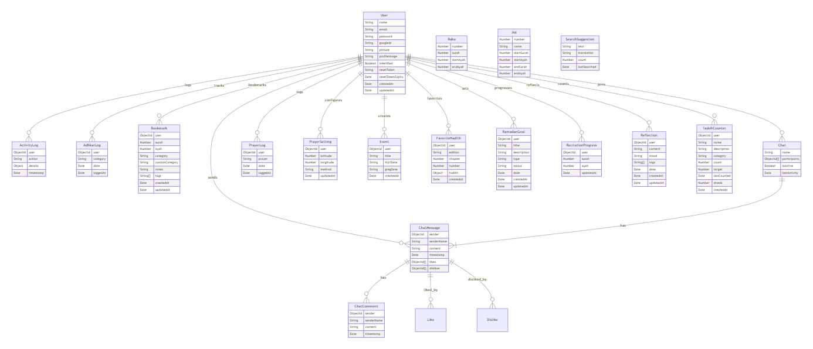
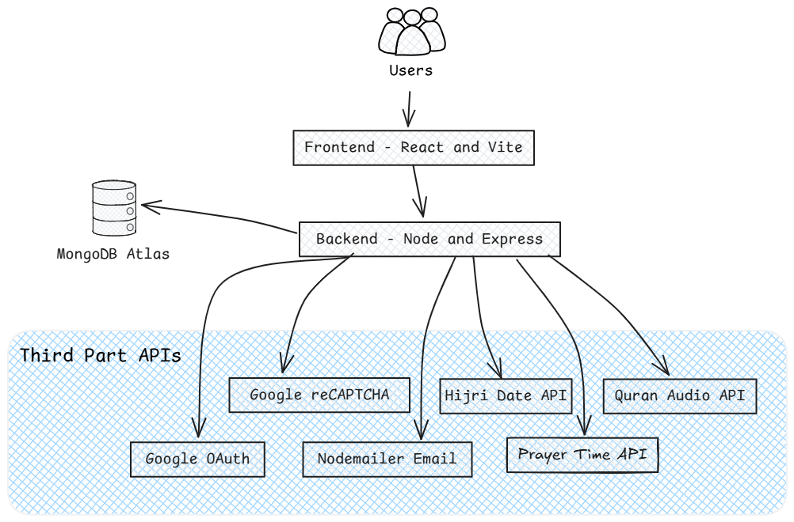

# Ramadan Flow

A comprehensive Islamic application designed to enhance your Ramadan experience and help Muslims maintain their daily religious practices throughout the year. Ramadan Flow helps you track prayers, read Quran, set and achieve Ramadan goals, and connect with the community.

## Features

### Prayer & Worship
- Prayer time tracking with location-based calculations
- Digital Tasbih counter with customizable dhikr
- Prayer logs and statistics
- Qibla direction finder

### Quran Features
- Complete Quran with translation
- Bookmark management
- Juz and Surah navigation
- Reading progress tracking
- Search functionality

### Community Features
- Community chat system
- Real-time messaging
- Comments and interactions
- Activity tracking
- Event management

### Personal Development
- Ramadan goal setting and tracking
- Daily reflection journal
- Activity logging
- Favorite Hadiths collection

## Tech Stack

### Frontend
- React 18 with Vite
- TailwindCSS for styling
- Framer Motion for animations
- Socket.io for real-time features
- React Router for navigation
- Various UI libraries (Headless UI, Hero Icons)
- MapBox for location features
- ApexCharts for data visualization

### Backend
- Node.js with Express
- MongoDB with Mongoose
- Socket.io for real-time communication
- JWT for authentication
- Google OAuth integration
- Nodemailer for email services
- Twilio for SMS features

## Prerequisites

- Node.js (v16 or higher)
- MongoDB
- npm or yarn
- Google OAuth credentials
- MapBox API key
- Twilio account (optional)

## Installation

1. Clone the repository
```bash
git clone [repository-url]
cd [project-directory]
```

2. Install Backend Dependencies
```bash
cd backend
npm install
```

3. Configure Environment Variables
```bash
cp .env.example .env
# Edit .env with your configuration
```

4. Install Frontend Dependencies
```bash
cd ../frontend
npm install
```

5. Configure Frontend Environment
```bash
cp .env.example .env
# Edit .env with your configuration
```

## Running the Application

### Development Mode

1. Start Backend Server
```bash
cd backend
npm run dev
```

2. Start Frontend Development Server
```bash
cd frontend
npm run dev
```

### Production Mode

1. Build Frontend
```bash
cd frontend
npm run build
```

2. Start Backend Server
```bash
cd backend
npm start
```

## Environment Variables

### Backend (.env)
```
PORT=5000
MONGODB_URI=your_mongodb_uri
JWT_SECRET=your_jwt_secret
GOOGLE_CLIENT_ID=your_google_client_id
GOOGLE_CLIENT_SECRET=your_google_client_secret
SMTP_HOST=your_smtp_host
SMTP_PORT=your_smtp_port
SMTP_USER=your_smtp_user
SMTP_PASS=your_smtp_password
TWILIO_ACCOUNT_SID=your_twilio_sid
TWILIO_AUTH_TOKEN=your_twilio_token
```

### Frontend (.env)
```
VITE_API_URL=http://localhost:5000
VITE_GOOGLE_CLIENT_ID=your_google_client_id
VITE_MAPBOX_TOKEN=your_mapbox_token
```

## Features in Detail

### Prayer System
- Automatic prayer time calculation based on location
- Prayer tracking and statistics
- Customizable prayer notifications
- Qibla direction finder using device compass

### Quran Interface
- Complete Quran text with translations
- Bookmark management
- Progress tracking
- Advanced search functionality
- Juz and Surah navigation

### Community Features
- Real-time chat system
- User profiles
- Activity feed
- Event creation and management
- Community engagement features

### Personal Tools
- Digital Tasbih with custom counters
- Daily reflection journal
- Ramadan goal setting
- Favorite Hadith collection
- Activity logging and tracking

## Contributing

1. Fork the repository
2. Create your feature branch (`git checkout -b feature/AmazingFeature`)
3. Commit your changes (`git commit -m 'Add some AmazingFeature'`)
4. Push to the branch (`git push origin feature/AmazingFeature`)
5. Open a Pull Request

## License

This project is licensed under the ISC License - see the LICENSE file for details.

## Authors

- Laiba Nadeem (22L-7998) 
- Eman Awan (22L-7996) 
- Attiya Hassan (22L-7865)
- Muhammad Rehan (22P-9106) 


## Diagrams

### Database Schema


### Application Architecture


